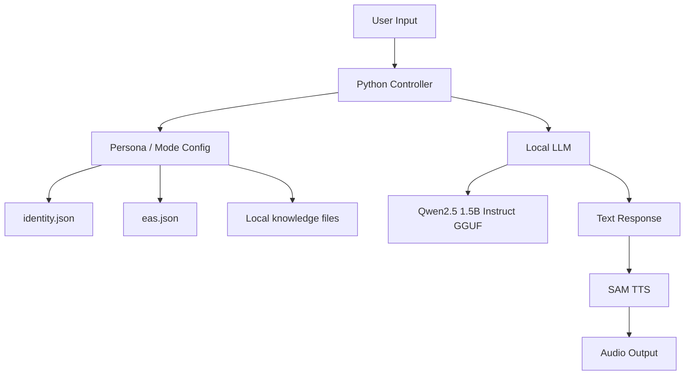

# Testing hosting a local language model


Artemis AI Voice Robot is an offline (future work will include possible online capabilities) Raspberry Pi voice assistant prototype that combines a local large language model with form of retro-style speech style. The project is designed around a Raspberry Pi 5 with 16 GB of RAM, Qwen2.5 1.5B Instruct GGUF, and SAM text-to-speech.

The initial goal is to build a small, self-contained AI robot personality that can respond locally without relying on any major cloud APIs. Artemis is currently being worked on in order to focus on an Emergency Alert System inspired mode, mixing things like practical instruction and fictional lore-driven behavior.

## Project Goals
- Run a local LLM on a Raspberry Pi 5.
- Generate voice output using SAM TTS.
- Support configurable AI personalities through JSON files.
- Build toward multiple interaction modes, starting with Artemis EAS Mode.

## Current System Overview


## Hardware

The current target hardware is:

- Raspberry Pi 5, 16 GB RAM
- MicroSD card (or SSD storage for possible future models)
- Speaker or audio output device
- Possible microphones for future voice input functionality
- Optional display, LEDs, servos, or robotic body components for future works

The project was designed to start as a terminal-based prototype before expanding into anything resembling a physical robot.

## Model
The current model is:

```text
Qwen/Qwen2.5-1.5B-Instruct-GGUF:Q4_K_M
```
## Download Qwen2.5 1.5B Instruct GGUF locally
```text
huggingface-cli download Qwen/Qwen2.5-1.5B-Instruct-GGUF qwen2.5-1.5b-instruct-q4_k_m.gguf --local-dir ~/models/qwen --local-dir-use-symlinks False
```

Then run with the following command 

```text
./build/bin/llama-cli -m ~/models/qwen/qwen2.5-1.5b-instruct-q4_k_m.gguf -cnv -t 4 -c 4096 -n 256
```

Note: This is just to test the model locally by it self without any external modifications

### Text-to-Speech

This project uses [SAM: Software Automatic Mouth](https://github.com/s-macke/SAM) as of this moment for its only mode, a C port of the classic 1982 Commodore 64 speech synthesizer, to generate a retro non-human robot voice locally on the Raspberry Pi.

The SAM binary is built directly on the Pi and used with Python through command-line calls that generate `.wav` audio files.

Note: The SAM source was modified to support longer generated responses by chunking input before the actual synthesis step.

Default voice settings:

| Parameter | Value |
|---|---|
| Pitch | 95 |
| Speed | 65 |
| Throat | 130 |
| Mouth | 110 |